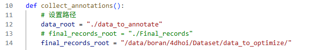

# Annotation App

## 1. Get Annotation Data from data_hoi

需要进入data_hoi文件夹，参数num表示获取多少个数据来进行标注

获取后的数据其他人将无法标注，所以务必确保能够尽快标完

```bash
cd /data/boran/4dhoi/data_hoi/

python get_annot_data.py --num 10

```

得到的文件夹会在/data/boran/4dhoi/data_to_annotate/下面，按照日期时间命名，下载到本地即可，注意要放到本地data_to_annotate文件夹下面

## 2. Annotate Keypoints
直接运行
```bash
python app_new.py
```
**一定要先检查一下物体scale，点击check看一下和人体的比例关系!!**

标完之后点击save保存，然后会自动跳转到下一个case，这时候会丢失背景但是影响不大还能继续标，另外有一个delete按钮点击之后会删除当前case的数据然后跳转到下一个case

结束标注直接点击右上角叉号即可

## 3. Update optimization information

在标注完之后需要把数据上传回服务器


分两步进行

1. 取出标好的数据：在Keypoint-app文件夹下面运行
   ```bash
   python output_annotated_data.py
   ```
   git clone 之后把这里改一下
   

    

   运行之后会在Final_records文件夹下面得到根据日期时间命名的文件夹，里面是这次标好的数据
2. 上传数据：把Final_records文件夹下面的文件夹上传到服务器的相应位置
   ```bash
   "/data/boran/4dhoi/Dataset/data_to_optimize/"
   ```
   在/data/boran/4dhoi/Dataset/文件夹下面运行
   ```bash
   update_optimize_data.py
   ```
   完成所有的上传步骤


# VNC使用指南

## 基本配置
见notion: [vnc配置](https://weak-ground-f42.notion.site/VNC-759688280edb4b969d7c95ca1c30665c)

## 连接

下载[TigerVNC Viewer](https://sourceforge.net/projects/tigervnc/)(不可以下其他的vnc工具)

首先vscode（或者终端）端口转发

在vncviewer里面打开 localhost:5914（vnc端口可自己配置，参考上面的文档）

密码:hanaichimonme

进入之后ctrl+alt+t打开终端，同样需要按照上面的步骤**get_annot_data_vnc.py --name boran**，记得加名字

运行目录在/data/boran/4dhoi/annotApp/Co-trackerApp/，需要在vnc里面开一个终端，进入该目录
环境是amodal，运行
```
python app_new.py --name boran
```
jike

标完跑完output_annotated_data.py，然后去/data/boran/4dhoi/Dataset/文件夹下面运行update_optimize_data.py

不需要再移动数据了，服务器上的数据移动已经改好了

