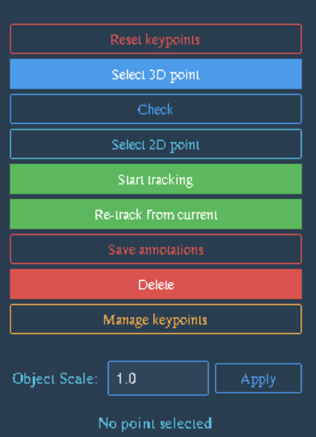
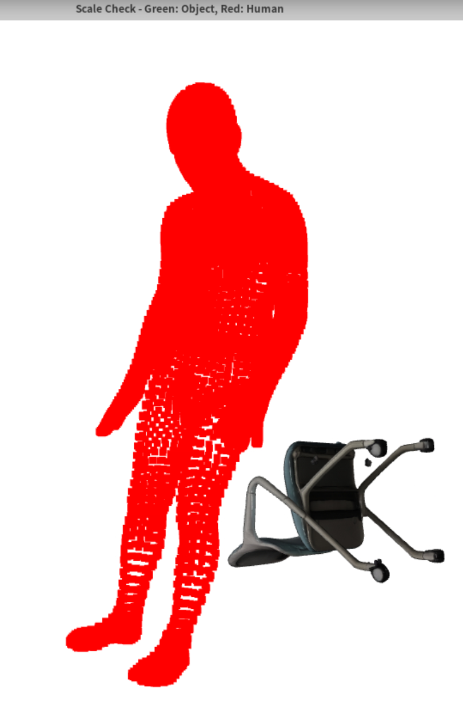
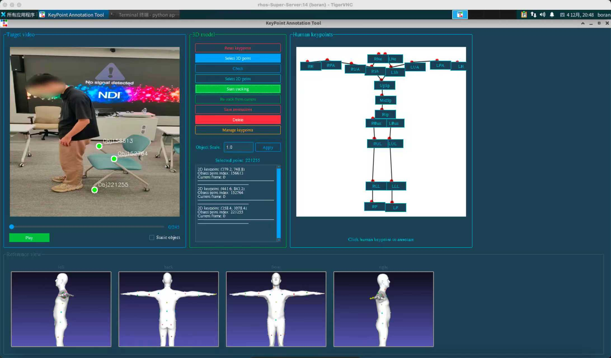
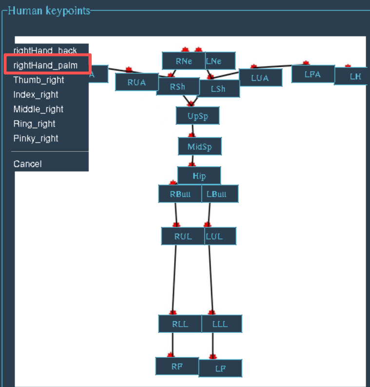

## Annotation App

### Prepare

put SMPLX_NEUTRAL.npz in ./data

### Usage

```
python app_new.py --video_dir ../demo
```   

### Annotate

The annotation tool consists of several modules to facilitate the process:

***All buttonds***:



1. **Video Display**
   It displays the video to be annotated, allowing users to select specific frames for annotation by dragging the timeline or playing the video.

2. **Check & Object Scale**
   This module is used to inspect whether the automatically reconstructed object size is correct, and to adjust the object scale when necessary.
   
   

3. **Static Object**
   We provide an option for annotators to mark an object as static when it remains stationary throughout the video. Once this option is selected, our subsequent optimization pipeline applies different strategies depending on whether the object is static or dynamic, enabling more efficient and stable processing.

4. **Select 3D Points**
   This module is used to select 3D contact points on the object, which are later matched with human keypoints or used for 2D point tracking. The corresponding points are selected within the Open3D-based 3D visualization interface.
   
   

5. **Select 2D Point**
   In this module, users select the projection of an object’s 3D point in the image of the current frame, which is used for tracking the object's pose. To ensure tracking quality, we visualize the tracking results in the video and require annotators to correct the tracked points when necessary.
   
   

6. **Manage Keypoints**
   To speed up the annotation process, when some object points change contact positions during annotation, we only need to adjust the human joint or tracking positions without reselecting the object’s 3D points. At the same time, we allow deleting contact points that are no longer relevant while keeping the others intact, avoiding the need for re-annotation and greatly improving efficiency.
   

7. **Human Keypoint**
   We display the human interaction joints in a hierarchical joint tree on the right side of the app. Annotators can click a parent joint to expand its child nodes, and then click the corresponding child node to complete the annotation. Additionally, at the bottom of the app, we show the keypoint locations to help annotators easily find the most suitable contact points.
   
   

8. **Save Annotations**
   Click the "Save annotations" button to save the annotation results to `./demo/kp_record_merged.json`.

### Notes

1. **Ensure Sufficient Degrees of Freedom (DoF)**
   Each frame must have at least **6 DoF** to ensure stable optimization.
   - A **3D-human joint annotation** provides **3 DoF**.
   - A **3D-2D annotation** provides **2 DoF**.
   
   Therefore, you need at least two 3D-human joint annotations (2 * 3 = 6) or three 3D-2D annotations (3 * 2 = 6) per frame, or a combination thereof.

2. **Annotation Strategy for Contact**
   - **3D-human joint annotations** should start from the frame where **contact begins**.
   - For the preceding segment where there is no contact, use **2D annotations** to constrain the object's pose and position.

