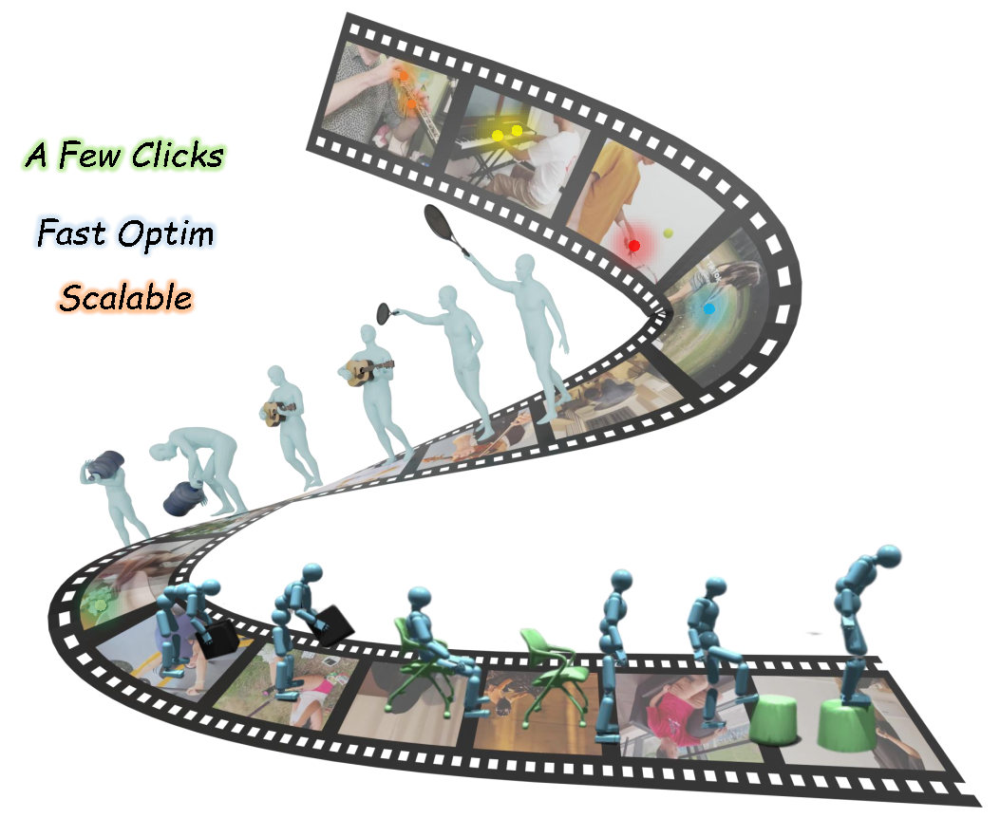

<div align="center">

Efficient and Scalable Monocular Human-Object Interaction Motion Reconstruction


</div>

<!-- 建议在这里放一张 teaser 图片或 GIF 动图，展示你的核心效果 -->

<p align="center">



</p>


## 📰 News

<!-- 记录项目的更新日志 -->

[2025-12-02] Annotate app code released!

[2025-12-03] 4DHOISolver code released!

## 🚀 To Do

[x] Release core inference code.

[ ] Release Automatic 4DHOI Reconstruction Code.

[ ] Release Dataset

## 🛠️ Installation


```
# Clone this repository

```


## 🖥️  Annotate app

### Data Preparation
You can download the test data from [Google Drive](https://drive.google.com/uc?export=download&id=1a9iUSfuuBrB2q6iewi4uxMAB9XIrvuJo) and place it in ./demo.

The data structure should be like this:
```
./demo
├── align ## depth alignment result for initialization
├── motion ## motion reconstruction from GVHMR
├── video 
└── obj_org.obj ## object model
```

### Install
please follow https://github.com/facebookresearch/co-tracker to install co-tracker.

```
cd Annot-app/co-tracker
pip install -e .
```

### Usage
See `Annot-app/co-tracker/README.md` for more details.


## 📖 Citation

If you find this code useful for your research, please consider citing our paper:

<!-- 替换为你的 BibTeX -->
```

```